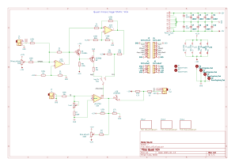
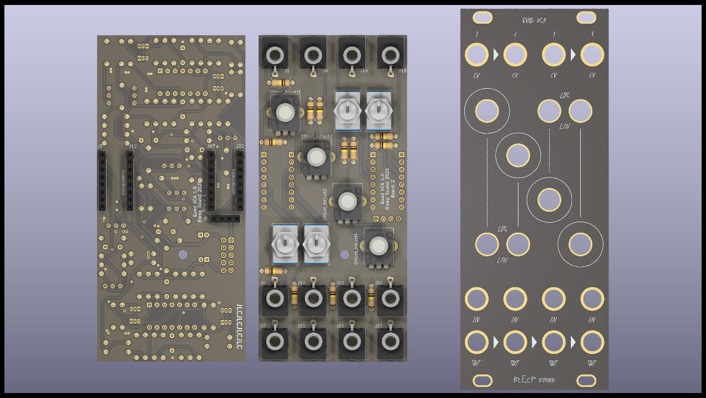
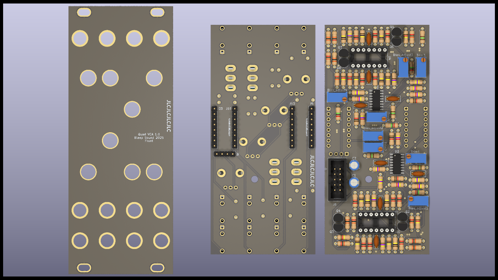
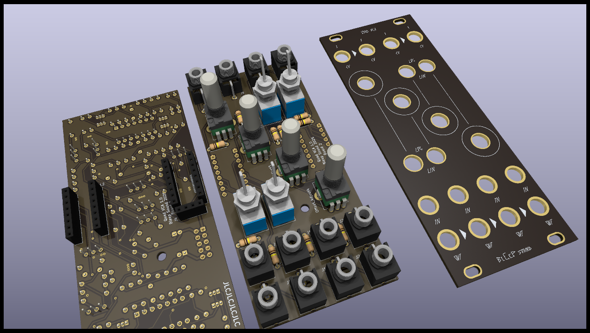

# Quad VCA

Quad VCA module, original desigh taken from Ray Wilson from [MFOS](https://musicfromouterspace.com/index.php?MAINTAB=SYNTHDIY&VPW=1697&VPH=669)

Possibility to have log and linear response for each VCA via a toggle switch. 

CV inputs are normalled for channel 1-2 and channel 3-4, to have a stereo VCA with one CV signal. 

All outputs are normalled to one another, to use the VCA as an active audio mixer. 

## Schematics

All 4 channels of the VCA are a repeat of this schematic. 

## BoM

[See bom](documentation/bom/Basic_VCA_V1.0--iBoM.html)

You have a bom in excel format available in the bom folder. 

## Build Informations

Uses SMD LM13700 because the DIP ones are not produced anymore (and expensive).

Regular build, I use ceramic capacitors but you can use film/polyester.

Polyester capacitor for the saw core. 

:warning: When building modules, always do it in this order (from smallest component to highest):
- diodes
- resistors
- DIP chips
- capacitors (film/ceramic)
- Transistors
- Electrolytic capacitors

To solder the headers, place them and place both PCBs in their final position before fully soldering the pin headers/sockets.

For the next parts, always place them without soldering them on: 
- jacks, pots and switches that go throught the front panel

Once placed, put the front panel in place, then fasten all components to it. Once this is done, you can solder all the remaining components.

